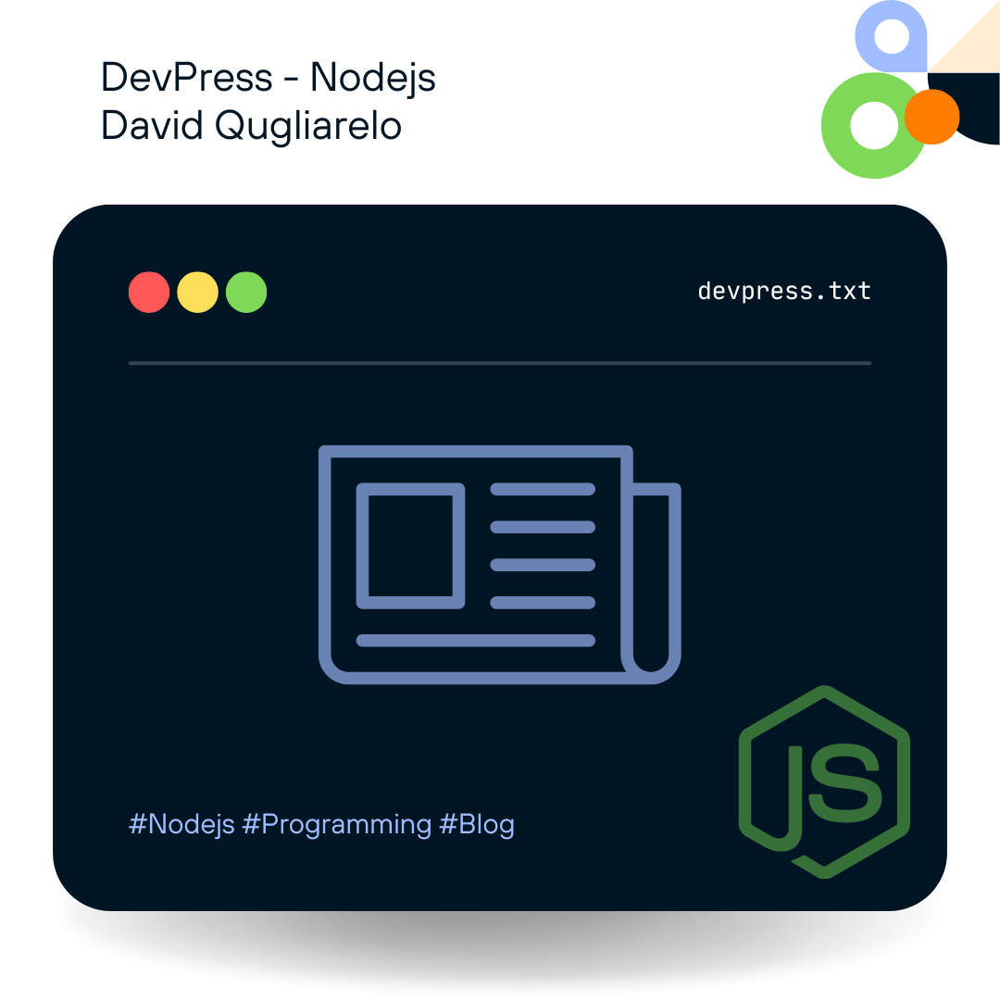
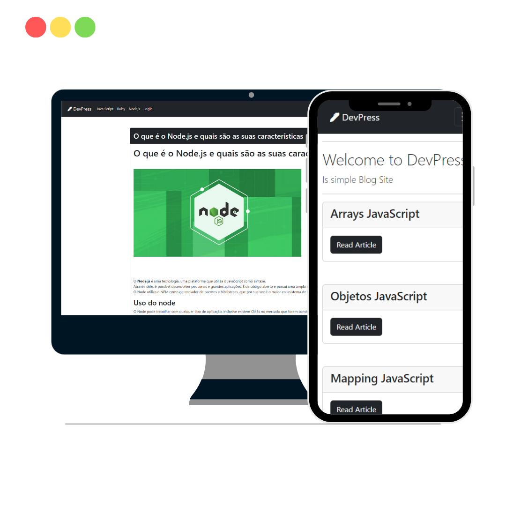
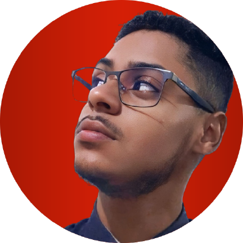

# DevPress



> Project developed in Nojejs, Sequelize, MySQL, Tinymce and arquiteture MVC.

### Designed for all platforms



>Devpress is an independent blog developed using Node and other technologies such as TinyMCE to develop professional articles! and with a large collection of resources.

## 💻 Request

Before you begin, make sure you've met the following requirements:

- You have installed the latest version of `<Nodejs lts/Npm last version>`
- You have a `<Windows/Linux/Mac>` machine. Indicate which operating system is supported/not supported.

## 🚀 Installing DevPress

To install DevPress, follow these steps:

Windows, Linux and macOS:

```
<git glone https://github.com/DavidQuagliarelodev/Node_DevPress>
```
```
<npm install>
```

## ☕ Using DevPress

To use DevQuestion, follow these steps:


```
<npm start>
```

## 🤝 Developer

<table>
  <tr>
    <td align="center">
      <a href="#" title="Image ">
        <br>
        <sub>
          <b>David Quagliarelo</b>
        </sub>
      </a>
    </td>
</table>